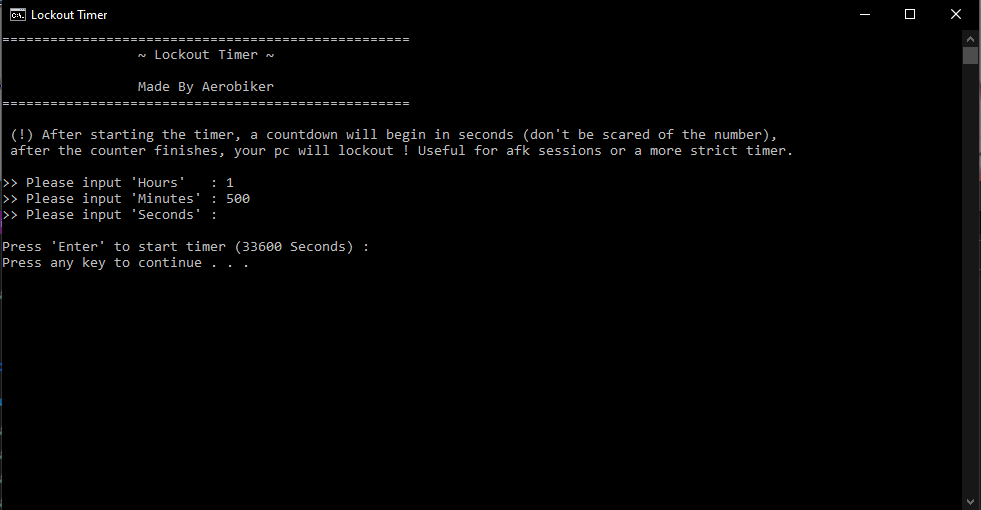
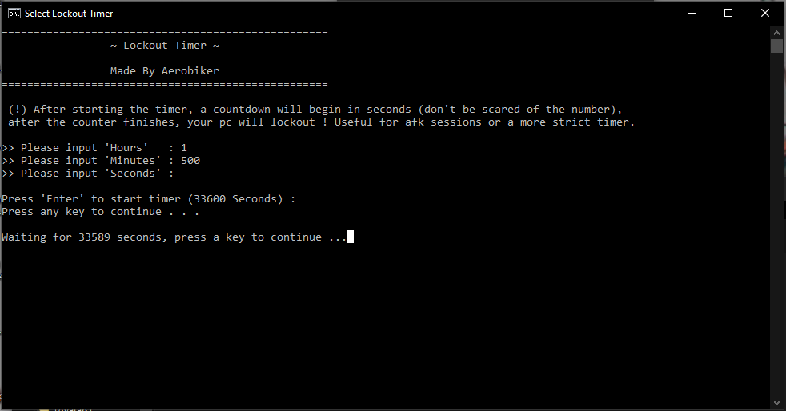

# Simple Lockout Timer
A timer that simply counts down for as long as specified, to then suddenly lock your session/screen, making a very effective disconnection tool for social media, manga, or other time wasting activities.

## Mode of operation
When starting the timer, you will be prompted with hours, then minutes then seconds, you can enter any number of those since the whole system counts the number of seconds that passed. But any random input that is not numerical, will be interpreted as a 0 (for instance : 'a' or 'qpofaij' for example, will be changed to 0). But if a negative number of 0 total seconds are given, then a error message will appear and will ask to re enter the input **TWICE**.

## At the end of the timer
When the timer is active, a countdown will be shown in the console for as many minutes you have given the program. At the end of that timer or if the timer is cancelled through a key press, will promptly **Lock you out** of your computer, so please be carful when touching the console, and **close it with the red/white cross on the top right**.

## My aim with this project
My aim at the end of this project was to make a simple **study** timer for my lazy self who easily skips the normal timers of any kind because they are so annoying, and they have no real impact. The only other solution I had for this reason, was to use the built in parental controls to block myself out of my computer to study (but this is quickly not an option when you have to study on it !). So this tool was made for this main reason.
After creating it, I realised this could be used for those who need to have their account open for a while for some task, but needs to leave to do something else. So you could set up a timer, to close your session after that task has ended (for instance, I have read on a forum that someone made a program that auto logs in, then promptly closes the session, making all the apps start).

PS : For this last one, you can use my simple Start-up file injection tool, to insert a .bat file with the lockout line inside. Witch will start up the file when logging in, simply locking out the session, but not executing again after that. (But please don't use shutdown with this trick).
